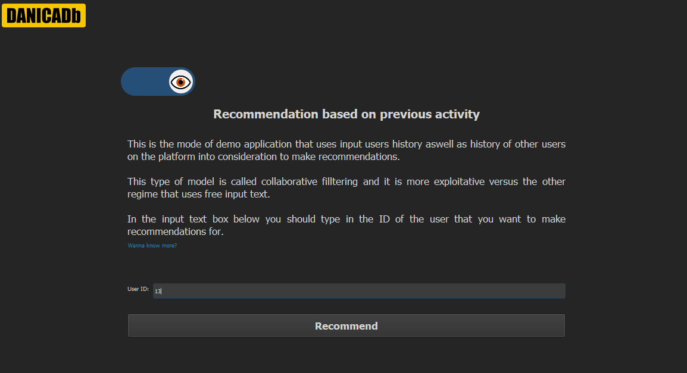
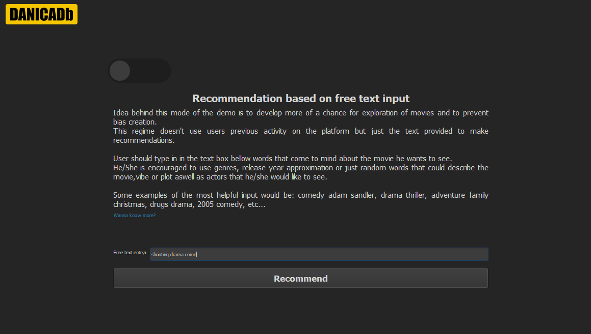
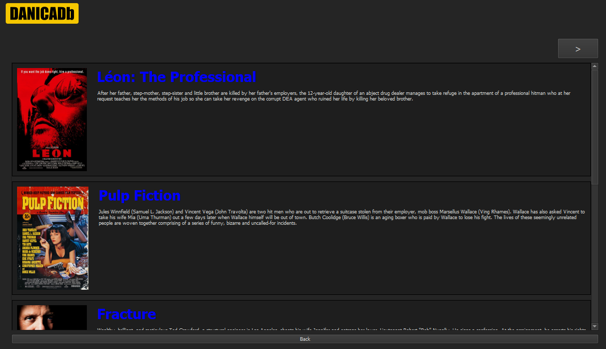

# Ethical Movie Recommender
Ethical Movie Recommender

__Ethical Movie Recommender__ is a _PyQt5_ desktop application written in _Python_ implementing two types of Recommender Systems.  
It offers the option for the user to switch to a second(___ethical___) regime at any time.  
When using the ethical mode users previous activity and data about his preference and taste won't be used for making the recommendation. The only information that will be used is
whatever voluntary free text user choses to give to _describe_ a potential movie that he/she would like to watch.

1. __Collaborative Filtering mode__
2. __Free text entry = Ethical mode__

## Motivation For The Project

With the drastic increase in use of Recommender Systems today it brought up
some ethical questions that this project is trying to solve:
* Personal Autonomy
* Transparency
* Polarization

Maybe it is hard to see some of these ethical problems as a huge issue that needs to be fixed when thinking about recommending _movies_. 
But for example when talking about News Broadcasting platforms, journalism articles and Research it is clear how
the problem of ___polarization___ or ___personal autonomy___ can make serious issues and changes in society.

Beyond ethical problems is also noticed that ___exploration - discovering new items___   functionality of recommendaiton platforms is often overlooked.

With this demo application and using a movie dataset just as an example, I tried to give one of the possible solutions to these problems.

## Dataset
Dataset used in this project is available to the public and downloaded from the GroupLens website:
https://grouplens.org/datasets/

## TWO REGIMES
### 1. Collaborative Filtering

First regime implements Collaborative Filtering, using information about users previous activity to make most accurate recommendations.
* ___Cold Start___ problem for this demo is not solved, this problem is avoided by acting like we are already an existing
user on the platform. There is a popularity function that is declared but not implemented that can be used as  a solution to Cold Start.

_Techniques/Steps used to make predictions:_  
  __1. Dataset preprocessing__  
  __2. Data transformation__  
  __3. Matrix factorization/normalization__  
  __5. Nearest Neighbors algorithm__  
  __6. Transforming results__  
  __7. Making predictions__  

### 2. Free text entry

Whenever the user choses, he can switch to a second regime, also called the __Ethical regime__ or __Free Text Entry__. 
This mode is not considering users history on the platform to make recommendations. 
User has complete control over the information that the algorithm would use.

_Steps:_  
  __1. Dataset Transforming and Preprocessing__  
  __2. User input processing__  
  __3. Making the recommendation__  

_Techniques used_ :  __Natural Language Processing tools, Lexical Text Similarity, lematization, tokenization, Leveshtein distance, Cosine Distance, Jaccardi Similarity  __

### The Final Recommendations
